# Multifunctional-USV

## 1.外观

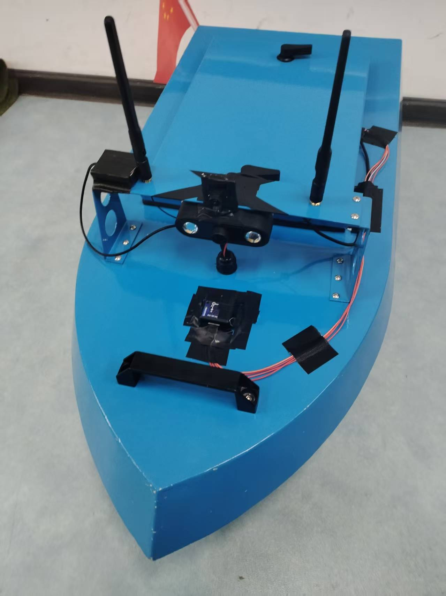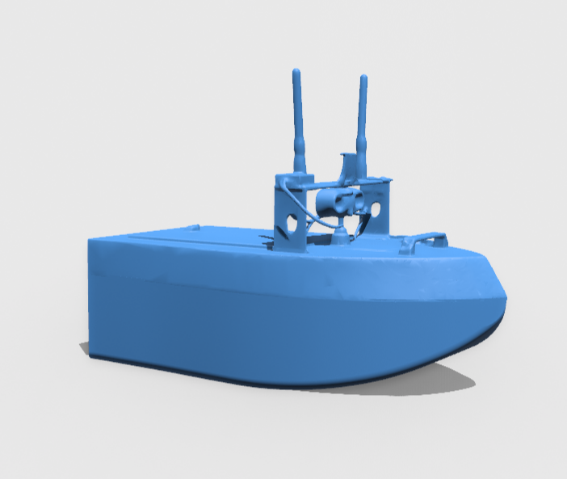

## 2. 功能

### 2.1 导航
导航功能包括路径规划与路径跟踪，路径规划使用A*算法进行全局路径规划，路径跟踪使用纯追踪算法进行控制，导航功能的输入为当前船所在位置、目标位置、障碍栅格地图，输出为控制指令。

#### 2.1.1 路径规划
由已知的心海湖障碍栅格地图、当前船所在位置、目标位置，结合A*算法搜索到如图2所示蓝色路径，经过剪枝，得到航路点折线路径。
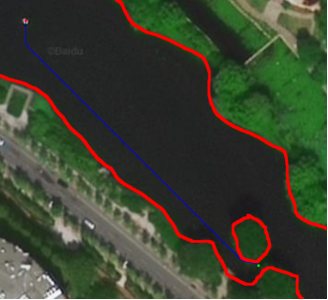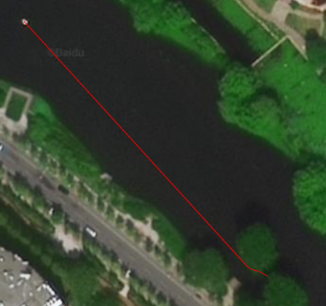
路径剪枝后得到如下9个航路点： [(1065, 1039), (1046, 1006), (1045, 1000), (1043, 993), (1042, 988), (1039, 979), (1034, 969), (1027, 961), (89, 106)]，用八阶贝塞尔曲线拟合,得到t参数化路径
**对于参数 $ t \in [0, 1] $，$ n $ 阶贝塞尔曲线的参数方程为：**

\[
P(t) = \sum_{k=0}^{n} C(n,k) \cdot t^k \cdot (1 - t)^{n-k} \cdot P_k\]其中：
\[
C(n,k) = \frac{n!}{k!(n-k)!}
\]为组合数
\[
P_k = (x_k, y_k)
\]
为第 $ k $ 个控制点

计算得八阶贝塞尔曲线方程为：
\[
x(t) = 1 \cdot (1 - t)^8 \cdot 1065 + 8 \cdot t \cdot (1 - t)^7 \cdot 1046 + 28 \cdot t^2 \cdot (1 - t)^6 \cdot 1045 + 56 \cdot t^3 \cdot (1 - t)^5 \cdot 10432 + 70 \cdot t^4 \cdot (1 - t)^4 \cdot 1042 + 56 \cdot t^5 \cdot (1 - t)^3 \cdot 1039 + 28 \cdot t^6 \cdot (1 - t)^2 \cdot 10343 + 8 \cdot t^7 \cdot (1 - t) \cdot 1027 + 1 \cdot t^8 \cdot 89
\]
\[
y(t) = 1 \cdot (1 - t)^8 \cdot 1039 + 8 \cdot t \cdot (1 - t)^7 \cdot 1006 + 28 \cdot t^2 \cdot (1 - t)^6 \cdot 1000 + 56 \cdot t^3 \cdot (1 - t)^5 \cdot 9936 + 70 \cdot t^4 \cdot (1 - t)^4 \cdot 988 + 56 \cdot t^5 \cdot (1 - t)^3 \cdot 979 + 28 \cdot t^6 \cdot (1 - t)^2 \cdot 9697 + 8 \cdot t^7 \cdot (1 - t) \cdot 961 + 1 \cdot t^8 \cdot 106
\]
下图中绿色曲线为贝塞尔拟合曲线
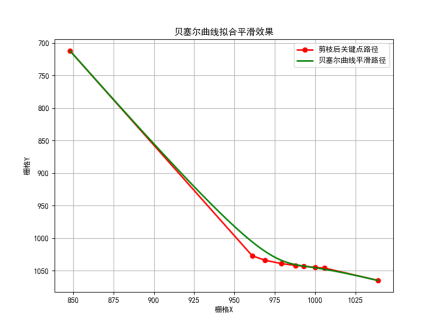

#### 2.1.2 路径跟踪
路径跟踪是在贝塞尔拟合路径上基础上进行的，制导算法使用LOS制导，根据当前船所在位置与LOS输出的参数化路径上的目标点，计算出船的 heading 角度与速度指令，使船沿着贝塞尔拟合路径行驶。
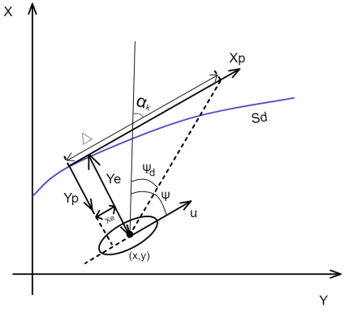
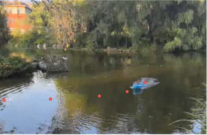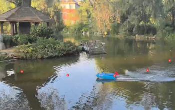
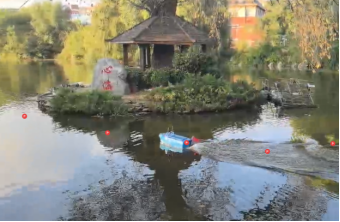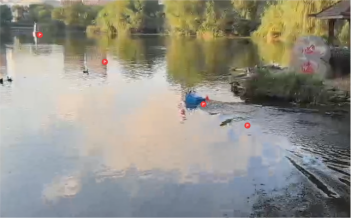
## 3. 系统设计
### 3.1 控制系统
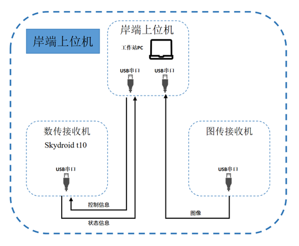
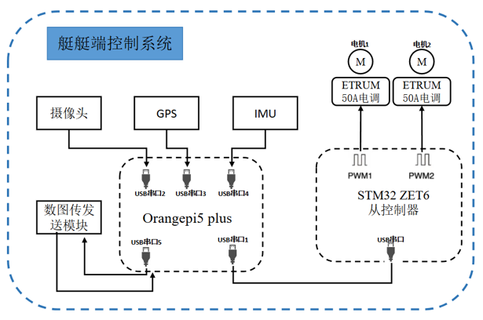

控制系统由主控RK3588和下位机STM32F103ZET6组成，通信系统由数、图传电台组成。
推进器为直流无刷电机，全密封舱体结构，单个推进器在额定功率下可提供2.0 kg的正向推力，电子换向器支持持续50A工作电流，并能承受10s内150A的瞬时峰值电流。
感知模块（摄像头、GPS、IMU）采集环境与自身状态数据，传输给OrangePi主控，主控处理数据，生成运动控制指令，通过USB下发给STM32从控制器，从控制器将指令转换为PWM信号，驱动电机，实现艇的运动控制，数图传送模块同步回传图像与系统数据，支持远程监控与操作。
### 2.2 目标检测
检测目标为湖标灯，获取来自船体摄像头的200张训练集图片，每张图片包含1个湖标灯，每个湖标灯的像素大小介于50x50 ~200x200 像素，完整包含小中大目标，分辨率为640x480，使用Ultralytics官方YOLOv5模型与训练函数进行训练，训练集图片中湖标灯的标注框基本位于图片中心，训练集图片中湖标灯的标注框角度为0度。损失函数、mAP、精确率、召回率曲线图如下：
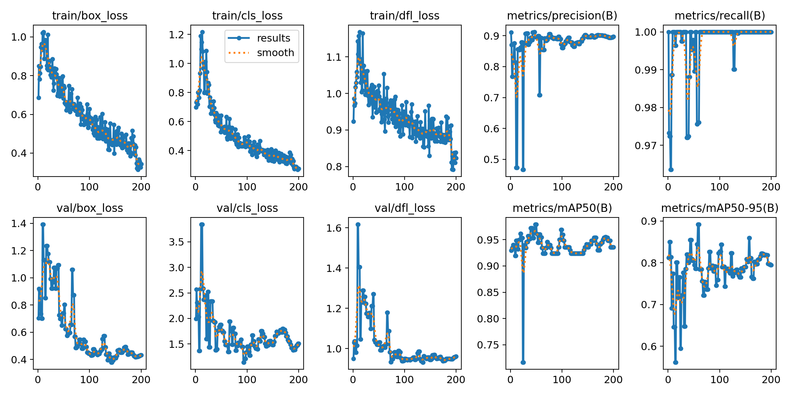
实际检测效果图如下：
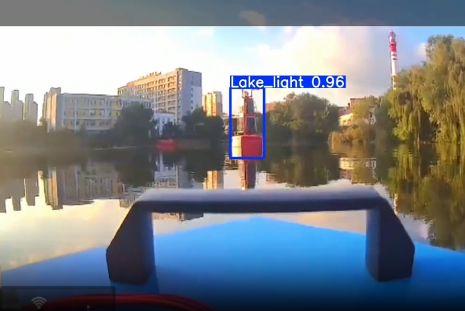

### 2.3 实例分割

